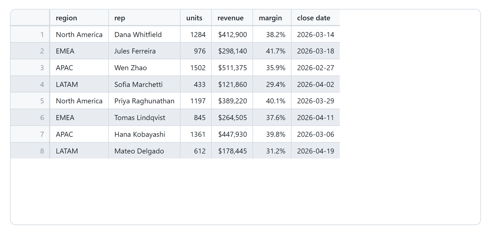
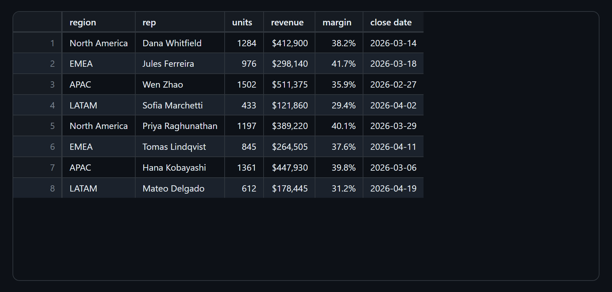
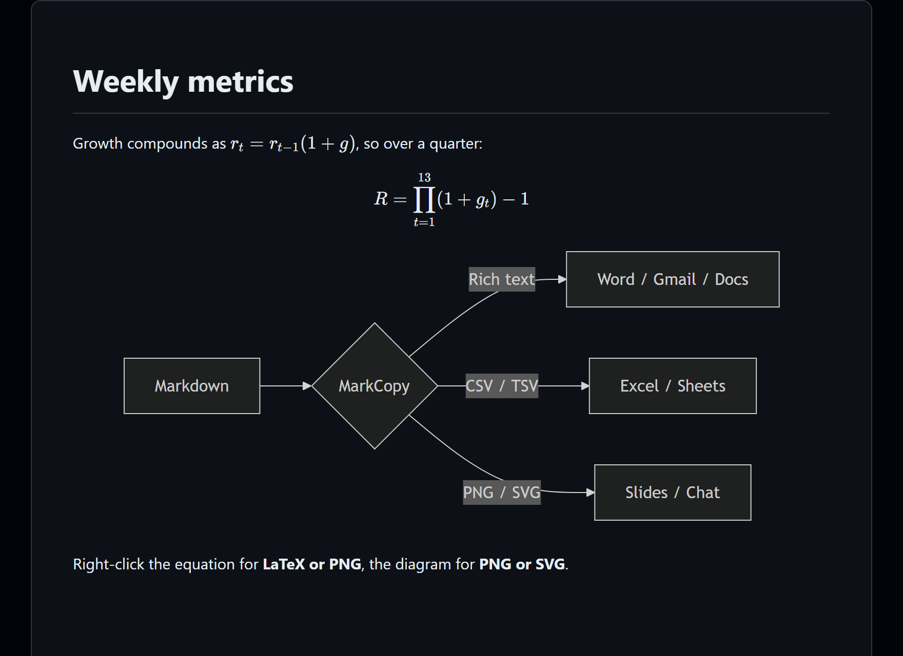
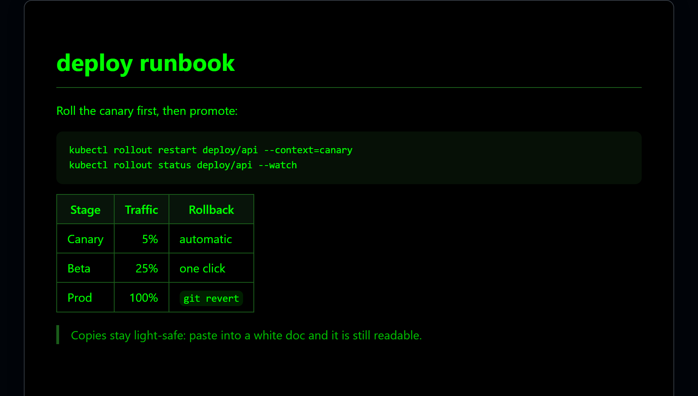
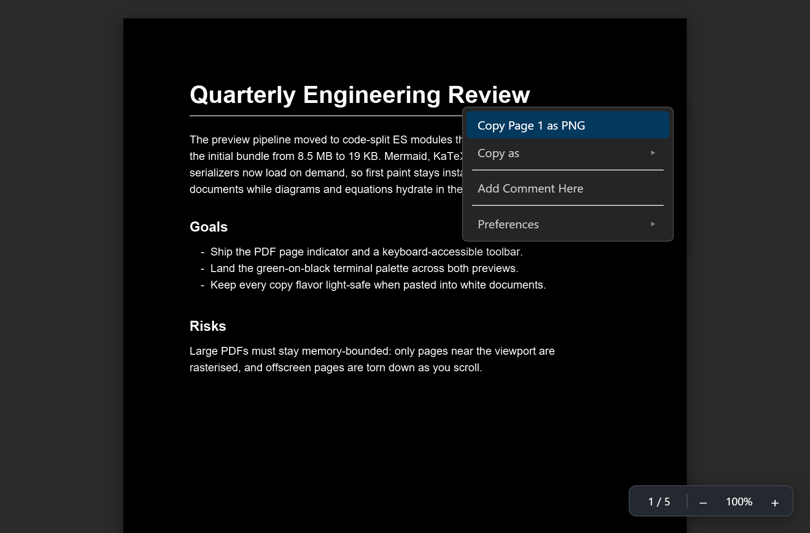

# MarkCopy: Rich Markdown, CSV, Excel, PDF & STL Preview

[](https://marketplace.visualstudio.com/items?itemName=OwenPKent.markcopy)
[](https://open-vsx.org/extension/OwenPKent/markcopy)
[](https://github.com/owenpkent/markcopy/actions/workflows/ci.yml)
[](LICENSE)
[](https://code.visualstudio.com/)
[](.github/CONTRIBUTING.md)

**Install:** from the [VS Code Marketplace](https://marketplace.visualstudio.com/items?itemName=OwenPKent.markcopy), from [Open VSX](https://open-vsx.org/extension/OwenPKent/markcopy) (Cursor, VSCodium, Windsurf), or run `code --install-extension OwenPKent.markcopy`.

> The preview built for getting content _out_. Right-click anywhere in the rendered preview and copy it in the format you actually need: rich text that pastes **with formatting** into Word, Outlook, Gmail and Google Docs, a per-element copy of a code block or table, the raw Markdown source, or a PNG image of a diagram. It opens CSVs as a real spreadsheet-style grid, PDFs with a selectable text layer, and STL models in a 3D viewer, so one extension previews them all.

VS Code's built-in preview and the popular alternatives (Markdown Preview Enhanced, Markdown All-in-One, GitHub Styling) have no first-class "copy the rendered output as rich text." MarkCopy is designed around exactly that.


<!-- The images are generated from the real preview bundles (media/webview.js, media/pdf.js) + media/preview.css via `npm run screenshot`. A screen-recorded GIF of pasting into Word or Gmail would be a welcome contribution. -->

MarkCopy follows your VS Code theme, with a polished GitHub-light or GitHub-dark palette:


Open a `.csv` or `.tsv` and you get a proper grid: a header and row numbers that stay put as you scroll, alternating row colors, numbers aligned right, and columns you can drag to resize (double-click a divider to fit it to its contents). Cells are editable in place, and edits go straight into the file, so Ctrl+Z undoes them normally.





## Compared to the alternatives

|                                          | Built-in | Markdown Preview Enhanced | MarkCopy |
| ---------------------------------------- | :------: | :-----------------------: | :------: |
| Rich-text copy from the rendered preview |    No    |            No             | **Yes**  |
| Per-code-block copy                      |    No    |      Requested, open      | **Yes**  |
| Table as CSV / TSV / cells               |    No    |          Partial          | **Yes**  |
| Diagram as PNG to clipboard              |    No    |      Export to file       | **Yes**  |
| Copy block as Markdown source            |    No    |            No             | **Yes**  |
| Live preview + scroll sync               |   Yes    |            Yes            | **Yes**  |
| CSV / TSV grid preview                   |    No    |            No             | **Yes**  |
| Edit CSV cells in the preview            |    No    |            No             | **Yes**  |
| Excel (.xlsx) preview                    |    No    |            No             | **Yes**  |
| Copy a spreadsheet range as Markdown     |    No    |            No             | **Yes**  |
| PDF preview built in                     |    No    |            No             | **Yes**  |
| STL 3D model preview                     |    No    |            No             | **Yes**  |

## Why it exists

When you copy Markdown you only get `text/plain`, the raw `# heading *asterisks*`. Word, Outlook, Gmail and Google Docs are rich-text editors: they render formatting only when it arrives on the clipboard as `text/html`. MarkCopy renders your Markdown, then writes **both** `text/html` and `text/plain` to the clipboard so the receiving app keeps your headings, bold, lists, tables, links and code. Styles are inlined so the formatting even survives Gmail and Outlook, which strip `<style>` blocks and external CSS.

## Features

- **Copy as Rich Text**, for the whole document or just a selection. Pastes formatted into Word, Outlook, Gmail, Google Docs, Slack and OneNote.
- **Per-element right-click copy**, with a short top-level menu that names whatever you clicked and a **Copy as** submenu for every other format:
  - Selection: top level copies **Rich Text**; **Copy as** has **Markdown**.
  - Code block: top level copies **Plain Text**.
  - Table: top level copies **Rich Text**; **Copy as** has **Markdown**, **CSV**, **TSV** (both paste as real cells in Excel and Google Sheets), and **PNG**. This is also how a spreadsheet sheet leaves as a Markdown table.
  - Mermaid diagram: top level copies **PNG**; **Copy as** has **SVG**.
  - Equation (KaTeX): top level copies **PNG**; **Copy as** has **LaTeX**.
  - Any other block: top level copies **Rich Text**; **Copy as** has **Markdown source** and **PNG**.
- **Copy as raw Markdown**, for a selection or a single block, from the **Copy as** submenu.
- **Save as PDF.** Export the rendered preview straight to a PDF file: pick where to save it and MarkCopy writes it, then opens it. No print dialog to work through and no filename header or URL footer on the pages, with equations, diagrams, highlighted code, and local images intact and the text still selectable. See [Save as PDF](#save-as-pdf).
- **Excel preview.** Open an `.xlsx` or `.xlsm` and it renders as a grid, with sheet tabs along the top and the column letters and row numbers a spreadsheet shows. Values appear the way the workbook formats them, so a date is a date and not `45000`, a percentage is `15.3%` and not `0.153`, and a formula shows its stored result. Merged cells stay merged, and anything the author hid (rows, columns, or whole sheets) stays hidden. Then right-click and take the whole sheet out as rich text, Markdown, CSV, TSV, or PNG.

  The preview is **read-only by design**: MarkCopy never writes to your workbook, so it cannot corrupt one. See [Settings](#settings) for `markcopy.xlsx.*`.

- **CSV and TSV preview, with editing.** Open a `.csv` or `.tsv` and it renders as a spreadsheet-style grid instead of a wall of commas: a sticky header row and row-number gutter, alternating row colors, numeric columns aligned right, and long values clipped with an ellipsis so rows stay one line tall. The delimiter is detected automatically (comma, tab, semicolon, or pipe, with a `.tsv` always read as tab-separated) and quoted fields follow RFC 4180, so commas, quotes, and newlines inside a cell all survive. See [Settings](#settings) for `markcopy.csv.*`.
  - **Edit cells in place.** Click to select, then double-click, press Enter or F2, or just start typing. **Enter** commits and moves down, **Tab** commits and moves right, **Shift+Enter** puts a newline inside the cell, **Escape** discards, **Delete** clears, and the arrow keys move around. Headers are editable too. Edits go straight into the file, so **Ctrl+Z** undoes them like any other change, and only the edited field is rewritten: the rest of the row keeps its original bytes, quoting and line endings included.
  - **Resizable columns.** Drag any column divider, double-click one (or press Enter on it) to fit the column to its contents, and right-click for **Reset Column Widths**.
  - **Copy anything out.** The grid is a real table, so the whole right-click copy menu works on it: **Copy Table** as rich text, or **Copy as** CSV, TSV, or PNG. The row-number gutter is viewer chrome and stays out of every one of them, so what you paste is the data in the file.
- **Live preview** that updates as you type, with editor and preview scroll kept in sync.
- **Auto-open preview**, on by default (`markcopy.autoPreview`). Opening or focusing a Markdown, CSV, or TSV file opens the preview beside it, or retargets an already-open preview to it, without moving your cursor or opening a new column. Close a preview and it stays closed for that file until you reopen it.
- **GitHub-accurate styling** for output that pastes cleanly into docs and email.
- **First-class light and dark.** The preview matches your theme with a GitHub-light or GitHub-dark palette, and copied rich text is always light-safe, so it stays readable when pasted into a white document even from a dark preview. A **green-on-black** terminal palette is available too (`markcopy.theme: green`, or **Green on black** under **Preferences > Theme**).
- **Mermaid diagrams** (flowchart, sequence, class, state, gantt, pie, and more) that follow the light/dark theme, plus syntax-highlighted code, out of the box. Configure Mermaid via `markcopy.mermaid`.
- **Math rendering with KaTeX.** Inline `$...$` and display `$$...$$` Markdown math render as equations. Right-click one to copy it as a PNG or restore its original LaTeX source; "Copy as Markdown" also restores the LaTeX rather than the rendered markup. Toggle with `markcopy.math` (on by default, turn it off for docs that use literal dollar signs).
- **Local images render in the preview.** Relative and absolute paths (``, ``) resolve to the right file; remote (`http(s):`), `data:`, and `blob:` images are unchanged.
- **PDF preview built in.** Open any `.pdf` and MarkCopy renders it with pdf.js, with a real selectable text layer, right-click **Copy Page as PNG** or **Copy Selection**, and **Copy as** for page or document text. A floating toolbar shows the current page (click it to jump to any page) and zooms from 50 to 400 percent while keeping pages crisp, a **Preferences** submenu toggles between a Hand tool (drag to pan) and a Pointer tool (select text), and right-click **Add Comment Here** drops a pin comment saved next to the PDF. The pages share the Markdown preview's **Theme** submenu (Auto, Light, Dark, or **Green on black** phosphor), plus a session-only **Dark Pages** / **Light Pages** quick toggle, both under **Preferences**. One extension previews Markdown, CSV, Excel, PDF, and STL.
- **STL 3D preview.** Open an `.stl` and it opens in a Three.js viewer instead of a wall of binary: left-drag to orbit, right-drag to pan, scroll to zoom, with the camera fitted to the model on load. A small toolbar offers **Fit view**, **wireframe**, and **grid**, and an overlay reports the triangle count and the bounding-box dimensions. Both binary and ASCII STL are read. There are no copy actions here: a triangle soup has nothing meaningful to put on a clipboard, so it is a viewer only. See [STL preview](#stl-preview).
- **Settings without leaving the preview.** Right-click for the **Preferences** submenu (**Theme**, and **Sync scroll** / **Auto-open preview** / **Math** toggles), or use the gear icon in the preview's title bar. Both write straight to your VS Code settings.



The optional green-on-black terminal palette (`markcopy.theme: green`):



See the full breakdown in the [Copy Matrix](docs/COPY-MATRIX.md): every action, the clipboard flavor it writes, and where it pastes cleanly.

## Getting started

1. Install the extension (see [Install](#install)).
2. Open any `.md`, `.csv`, or `.tsv` file. The preview opens automatically beside it (`markcopy.autoPreview`), or run **MarkCopy: Open Rich Preview to the Side** from the Command Palette or the right-click menu in the editor or Explorer. (`.pdf` and `.stl` files open straight in their own viewers.)
3. **Right-click inside the preview.** The menu options change based on whether you clicked a code block, table, diagram, plain block, or a text selection.

To grab everything at once, run **MarkCopy: Copy Whole Document as Rich Text**, or **MarkCopy: Save as PDF** to export the whole preview to a PDF file.

Local images in the document render automatically, and the right-click menu's **Preferences** submenu (or the gear icon in the preview's title bar) lets you change theme, sync scroll, math, and auto-preview without leaving the preview.

## Commands

| Command                                    | ID                                | What it does                                                          |
| ------------------------------------------ | --------------------------------- | --------------------------------------------------------------------- |
| MarkCopy: Open Rich Preview to the Side    | `markcopy.openPreview`            | Opens (or focuses) the preview beside the editor.                     |
| MarkCopy: Copy Whole Document as Rich Text | `markcopy.copyDocumentAsRichText` | Copies the entire rendered document as rich text.                     |
| MarkCopy: Save as PDF                      | `markcopy.saveAsPdf`              | Exports the rendered preview to a PDF file you choose, then opens it. |
| MarkCopy: Settings                         | `markcopy.openSettings`           | Opens the MarkCopy settings.                                          |

## Settings

`markcopy.syncScroll`, `markcopy.autoPreview`, `markcopy.math`, and `markcopy.theme` can also be changed live from the preview's right-click **Preferences** submenu or the gear icon in its title bar, not just here.

| Setting                    | Type                                   | Default   | Description                                                                                                                                                                                   |
| -------------------------- | -------------------------------------- | --------- | --------------------------------------------------------------------------------------------------------------------------------------------------------------------------------------------- |
| `markcopy.styleProfile`    | `github`                               | `github`  | Rendering style. `github` matches GitHub Markdown (best for pasting into docs and email).                                                                                                     |
| `markcopy.syncScroll`      | boolean                                | `true`    | Keep the preview scroll position in sync with the editor.                                                                                                                                     |
| `markcopy.autoPreview`     | boolean                                | `true`    | Automatically open the preview beside the editor when you focus a Markdown, CSV, or TSV file, and keep it targeted on whichever file has focus. Turn off to open previews manually.           |
| `markcopy.theme`           | `auto` \| `light` \| `dark` \| `green` | `auto`    | Preview palette. `auto` follows your VS Code theme; `light`, `dark`, and `green` (green-on-black terminal style) force it. Copies stay light-safe either way.                                 |
| `markcopy.mermaid`         | object                                 | `{}`      | Extra Mermaid config merged into `mermaid.initialize` (for example `fontFamily`, `flowchart`, or `themeVariables`). Diagrams follow the light/dark palette by default.                        |
| `markcopy.math`            | boolean                                | `true`    | Render `$...$` and `$$...$$` Markdown math as KaTeX equations. Turn off for documents that use literal dollar signs.                                                                          |
| `markcopy.csv.delimiter`   | `auto` \| `,` \| `\t` \| `;` \| `\|`   | `auto`    | Field separator for the CSV/TSV grid. `auto` picks whichever separator splits the file into the most consistent columns, except that a `.tsv` or `.tab` file is always read as tab-separated. |
| `markcopy.csv.headerRow`   | boolean                                | `true`    | Treat the first row of a CSV/TSV file as column headers. Turn off for files that start straight into data.                                                                                    |
| `markcopy.csv.maxRows`     | number                                 | `5000`    | Maximum rows to render. The grid says how many rows it is hiding; raise it to show more, at the cost of a slower preview on very large files.                                                 |
| `markcopy.xlsx.maxRows`    | number                                 | `5000`    | Maximum rows to render from a spreadsheet sheet. The grid says how many rows it is hiding.                                                                                                    |
| `markcopy.xlsx.maxColumns` | number                                 | `200`     | Maximum columns to render from a spreadsheet sheet.                                                                                                                                           |
| `markcopy.pdf.pageSize`    | `Letter` \| `A4` \| `Legal`            | `Letter`  | Paper size for **Save as PDF**.                                                                                                                                                               |
| `markcopy.pdf.browserPath` | string                                 | `""`      | Path to the Chrome, Edge, or Chromium executable used to render the PDF. Empty detects one automatically.                                                                                     |
| `markcopy.stl.showGrid`    | boolean                                | `true`    | Show a grid under the model in the STL preview.                                                                                                                                               |
| `markcopy.stl.meshColor`   | string                                 | `#8ab4f8` | Color of the mesh material in the STL preview.                                                                                                                                                |

## Install

**From the Marketplace** (published as [`OwenPKent.markcopy`](https://marketplace.visualstudio.com/items?itemName=OwenPKent.markcopy)):

- In VS Code: open the Extensions view, search **MarkCopy**, and click Install.
- Or from a terminal: `code --install-extension OwenPKent.markcopy`

It is also available on [Open VSX](https://open-vsx.org/extension/OwenPKent/markcopy) for Cursor, VSCodium, and Windsurf.

**From the packaged VSIX** (local build):

```bash
npm install
npm run vsix                                   # produces markcopy-<version>.vsix
code --install-extension markcopy-<version>.vsix
```

See [RELEASING.md](docs/RELEASING.md) for how releases are cut and published.

## How the copy works

`vscode.env.clipboard` is text-only, so rich copy happens **inside the webview**. MarkCopy writes both `text/html` and `text/plain` through a synchronous `copy`-event handler, which is more reliable than the async Clipboard API (that one can be permission-blocked inside the webview iframe). PNG copy uses `html-to-image` plus a `ClipboardItem`. The full rationale, including the Gmail/Outlook inline-styling requirement, is in [docs/ARCHITECTURE.md](docs/ARCHITECTURE.md#clipboard).

## Save as PDF

**MarkCopy: Save as PDF** (or the PDF button in the preview's title bar, or **Save as PDF…** in the right-click menu) asks where to save, writes the file, and opens it. What comes out is the preview as you see it: equations, diagrams, highlighted code, and local images intact, and real text rather than a picture of text, so it stays selectable and searchable.

It renders with a headless Chrome, Edge, or Chromium already installed on your machine instead of handing you to a browser's print dialog, which is what keeps the output clean:

- **No header or footer.** A print dialog stamps the document title across the top of every page and the `file://` URL across the bottom by default. Nothing does that here.
- **No stray page breaks.** A code block or table longer than a page flows across pages instead of being pushed onto one of its own, a table's header row repeats on every page it spans, and long code lines wrap instead of being cut off at the margin.
- **Backgrounds survive.** Code blocks, table headers, and blockquotes keep their fill, which a browser print drops unless you remember to ask for it.

`markcopy.pdf.pageSize` sets the paper size (Letter, A4, or Legal). If your browser is installed somewhere unusual, point `markcopy.pdf.browserPath` at it. With no Chromium-family browser installed at all, MarkCopy falls back to opening the preview in your default browser for you to print by hand.

## PDF preview

MarkCopy registers as the editor for `.pdf` files, so opening a PDF renders it inline (VS Code has no built-in PDF viewer). Rendering uses Mozilla's pdf.js, the same engine behind [folio](https://github.com/owenpkent/folio). Each page has a real, selectable text layer over the canvas, so you can highlight text directly on the page. Right-click a page for:

- **Copy Selection**: just the text you highlight (only shown when you have a selection).
- **Copy Page as PNG**: the rendered page as an image, for slides and chat.
- **Copy as**: **Page Text** or **All Text**, the selectable text extracted per page or for the whole document.
- **Add Comment Here**: drop a pin with an editable note; click a pin to edit or delete it. Comments are saved to a `<filename>.pdf.mccomments.json` file next to the PDF (the PDF itself stays read-only) and reload when you reopen it.
- **Preferences**: toggle between **Hand Tool (Drag to Scroll)** and **Pointer Tool (Select Text)**, toggle **Dark Pages** / **Light Pages** (a session-only override of the page palette that does not change the saved theme), and open the same **Theme** submenu as the Markdown preview (Auto, Light, Dark, or Green on black). Picking a theme persists `markcopy.theme` (shared with the Markdown preview) and re-tints the pages; Green on black renders them as green-on-black phosphor.



A floating toolbar in the bottom-right corner shows the current page (for example `3 / 12`) as you scroll; click it, type a page number, and press Enter to jump there. The same toolbar steps zoom through preset levels (50 to 400 percent) with minus/plus buttons, Ctrl and plus / Ctrl and minus / Ctrl and 0, or Ctrl plus the mouse wheel; clicking the percentage resets to 100 percent. Pages re-rasterise at each level, and only pages near the viewport stay rendered, so large PDFs stay sharp and memory-bounded. The view also has always-visible styled scrollbars.

The file is read by the extension host and handed to the webview as bytes, so nothing is fetched over the network. To open a PDF as raw bytes instead, use **Reopen Editor With...** from the editor title menu.

## STL preview

MarkCopy registers as the editor for `.stl` files, so opening one renders the model inline in a Three.js viewer. Controls are mouse-only, no keyboard required: **left-drag** to orbit, **right-drag** to pan, **scroll wheel** to zoom. The camera fits itself to the model on load, and the toolbar in the top-left offers **Fit view**, a **wireframe** toggle, and a **grid** toggle. An overlay in the bottom-left reports the triangle count and the bounding box as X x Y x Z.

Both binary and ASCII STL are handled. The model is centered in X and Z and rested on the y = 0 plane, so the grid always sits directly under it. The viewport background follows `markcopy.theme` along with the other previews; `markcopy.stl.showGrid` and `markcopy.stl.meshColor` set the grid and mesh color.

Corrupt and hostile files are rejected rather than loaded: a binary STL whose header claims more triangles than the file can hold, or any model above 10 million triangles, shows a message in the panel instead of hanging the viewer on a multi-gigabyte allocation. As with the PDF viewer, the file is read by the extension host and handed to the webview as bytes, so nothing is fetched over the network, and **Reopen Editor With...** opens the raw bytes instead.

There are no copy actions in this viewer, by design: an STL is a triangle soup with no text, tables, or images to put on a clipboard.

## Documentation

- [Copy Matrix](docs/COPY-MATRIX.md): every context-menu action and its clipboard output.
- [Architecture](docs/ARCHITECTURE.md): how rendering, the webview, and the clipboard fit together.
- [Contributing](.github/CONTRIBUTING.md): build, debug, and release.
- [Code of Conduct](.github/CODE_OF_CONDUCT.md).
- [Security](.github/SECURITY.md): CSP, sandboxing, and reporting.
- [Changelog](CHANGELOG.md).

## Develop

```bash
npm install
npm run compile     # type-check + build the extension and webview bundles
npm run watch       # rebuild on change
npm test            # vitest: unit tests plus the webview E2E suite
npm run test:integration   # runs the extension inside a real VS Code
# press F5 in VS Code to launch the Extension Development Host; it opens this
# repo, so sample.md, sample.csv, sample.pdf, sample.xlsx, and sample.stl are
# ready to preview
```

Full details in [CONTRIBUTING.md](.github/CONTRIBUTING.md).

## Roadmap

- PlantUML support.
- An "email-safe" export profile (table-based layout, fully inlined).

## License

[MIT](LICENSE)
