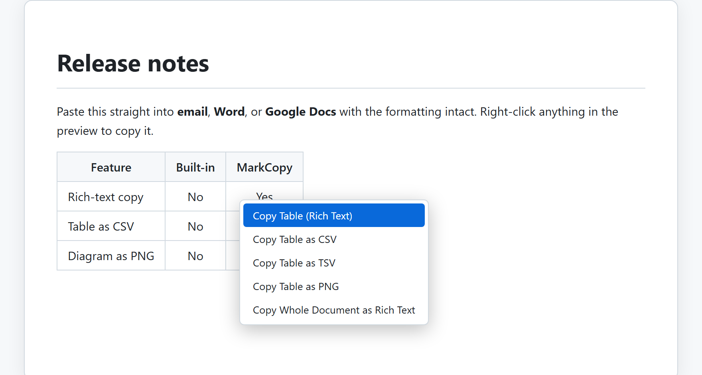
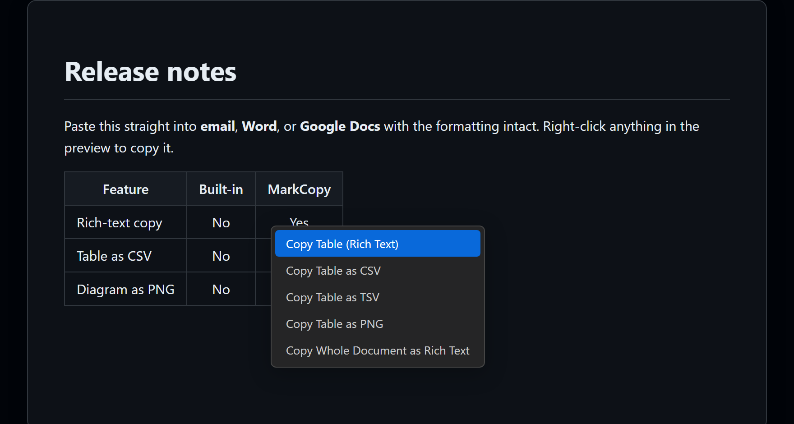

# MarkCopy: Rich Markdown & PDF Preview

[](https://github.com/owenpkent/markcopy/actions/workflows/ci.yml)
[](LICENSE)
[](https://code.visualstudio.com/)
[](CONTRIBUTING.md)

> The preview built for getting content _out_. Right-click anywhere in the rendered preview and copy it in the format you actually need: rich text that pastes **with formatting** into Word, Outlook, Gmail and Google Docs, a per-element copy of a code block or table, the raw Markdown source, or a PNG image of a diagram. It opens PDFs too, so one extension previews both Markdown and PDF.

VS Code's built-in preview and the popular alternatives (Markdown Preview Enhanced, Markdown All-in-One, GitHub Styling) have no first-class "copy the rendered output as rich text." MarkCopy is designed around exactly that.



<!-- The images are generated from the real preview + media/preview.css via `npm run screenshot`. A screen-recorded GIF of pasting into Word or Gmail would be a welcome contribution. -->

MarkCopy follows your VS Code theme, with a polished GitHub-light or GitHub-dark palette:



## Why it exists

When you copy Markdown you only get `text/plain`, the raw `# heading *asterisks*`. Word, Outlook, Gmail and Google Docs are rich-text editors: they render formatting only when it arrives on the clipboard as `text/html`. MarkCopy renders your Markdown, then writes **both** `text/html` and `text/plain` to the clipboard so the receiving app keeps your headings, bold, lists, tables, links and code. Styles are inlined so the formatting even survives Gmail and Outlook, which strip `<style>` blocks and external CSS.

## Features

- **Copy as Rich Text**, for the whole document or just a selection. Pastes formatted into Word, Outlook, Gmail, Google Docs, Slack and OneNote.
- **Per-element right-click copy**, with the menu adapting to what you clicked:
  - Code block: **Copy Code** as plain text.
  - Table: **Rich Text**, **CSV**, **TSV** (both paste as real cells in Excel and Google Sheets), or **PNG**.
  - Mermaid diagram: **PNG** or **SVG**.
  - Any block: **Rich Text**, **Markdown source**, or **PNG**.
- **Copy as raw Markdown**, for a selection or a single block.
- **Live preview** that updates as you type, with editor and preview scroll kept in sync.
- **GitHub-accurate styling** by default, or a profile that follows your VS Code theme.
- **First-class light and dark.** The preview matches your theme with a GitHub-light or GitHub-dark palette, and copied rich text is always light-safe, so it stays readable when pasted into a white document even from a dark preview.
- **Mermaid diagrams** and syntax-highlighted code out of the box.
- **PDF preview built in.** Open any `.pdf` and MarkCopy renders it with pdf.js, with right-click **Copy Page as PNG**, **Copy Page Text**, and **Copy All Text**. One extension previews both Markdown and PDF.

See the full breakdown in the [Copy Matrix](docs/COPY-MATRIX.md): every action, the clipboard flavor it writes, and where it pastes cleanly.

## Getting started

1. Install the extension (see [Install](#install)).
2. Open any `.md` file.
3. Run **MarkCopy: Open Rich Preview to the Side** from the Command Palette, the editor title-bar icon, or the right-click menu in the editor or Explorer.
4. **Right-click inside the preview.** The menu options change based on whether you clicked a code block, table, diagram, plain block, or a text selection.

To grab everything at once, run **MarkCopy: Copy Whole Document as Rich Text**.

## Commands

| Command                                    | ID                                | What it does                                      |
| ------------------------------------------ | --------------------------------- | ------------------------------------------------- |
| MarkCopy: Open Rich Preview to the Side    | `markcopy.openPreview`            | Opens (or focuses) the preview beside the editor. |
| MarkCopy: Copy Whole Document as Rich Text | `markcopy.copyDocumentAsRichText` | Copies the entire rendered document as rich text. |

## Settings

| Setting                 | Type                        | Default  | Description                                                                                                         |
| ----------------------- | --------------------------- | -------- | ------------------------------------------------------------------------------------------------------------------- |
| `markcopy.styleProfile` | `github` \| `vscode`        | `github` | `github` matches GitHub Markdown (best for pasting into docs and email); `vscode` follows the editor theme.         |
| `markcopy.syncScroll`   | boolean                     | `true`   | Keep the preview scroll position in sync with the editor.                                                           |
| `markcopy.theme`        | `auto` \| `light` \| `dark` | `auto`   | Preview palette. `auto` follows your VS Code theme; `light` and `dark` force it. Copies stay light-safe either way. |

## Install

**From the packaged VSIX** (local install):

```bash
npm install
npm run vsix                                   # produces markcopy-0.0.1.vsix
code --install-extension markcopy-0.0.1.vsix
```

**From the Marketplace:** not yet published. See [CONTRIBUTING](CONTRIBUTING.md#releasing) for the release flow.

## How the copy works

`vscode.env.clipboard` is text-only, so rich copy happens **inside the webview**. MarkCopy writes both `text/html` and `text/plain` through a synchronous `copy`-event handler, which is more reliable than the async Clipboard API (that one can be permission-blocked inside the webview iframe). PNG copy uses `html-to-image` plus a `ClipboardItem`. The full rationale, including the Gmail/Outlook inline-styling requirement, is in [docs/ARCHITECTURE.md](docs/ARCHITECTURE.md#clipboard).

## PDF preview

MarkCopy registers as the editor for `.pdf` files, so opening a PDF renders it inline (VS Code has no built-in PDF viewer). Rendering uses Mozilla's pdf.js, the same engine behind [folio](https://github.com/owenpkent/folio). Right-click a page for:

- **Copy Page as PNG**: the rendered page as an image, for slides and chat.
- **Copy Page Text** / **Copy All Text**: the selectable text, extracted per page.
- **Copy Selected Text**: just the text you highlight.

The file is read by the extension host and handed to the webview as bytes, so nothing is fetched over the network. To open a PDF as raw bytes instead, use **Reopen Editor With...** from the editor title menu.

## Compared to the alternatives

|                                          | Built-in | Markdown Preview Enhanced | MarkCopy |
| ---------------------------------------- | :------: | :-----------------------: | :------: |
| Rich-text copy from the rendered preview |    No    |            No             | **Yes**  |
| Per-code-block copy                      |    No    |      Requested, open      | **Yes**  |
| Table as CSV / TSV / cells               |    No    |          Partial          | **Yes**  |
| Diagram as PNG to clipboard              |    No    |      Export to file       | **Yes**  |
| Copy block as Markdown source            |    No    |            No             | **Yes**  |
| Live preview + scroll sync               |   Yes    |            Yes            | **Yes**  |
| PDF preview built in                     |    No    |            No             | **Yes**  |

## Documentation

- [Copy Matrix](docs/COPY-MATRIX.md): every context-menu action and its clipboard output.
- [Architecture](docs/ARCHITECTURE.md): how rendering, the webview, and the clipboard fit together.
- [Contributing](CONTRIBUTING.md): build, debug, and release.
- [Code of Conduct](CODE_OF_CONDUCT.md).
- [Security](SECURITY.md): CSP, sandboxing, and reporting.
- [Changelog](CHANGELOG.md).

## Develop

```bash
npm install
npm run compile     # type-check + build the extension and webview bundles
npm run watch       # rebuild on change
npm test            # vitest unit tests
# press F5 in VS Code to launch the Extension Development Host, then open sample.md
```

Full details in [CONTRIBUTING.md](CONTRIBUTING.md).

## Roadmap

- KaTeX / LaTeX math (render, and copy as image).
- PlantUML support.
- An "email-safe" export profile (table-based layout, fully inlined).
- A marketplace icon.

## License

[MIT](LICENSE)
