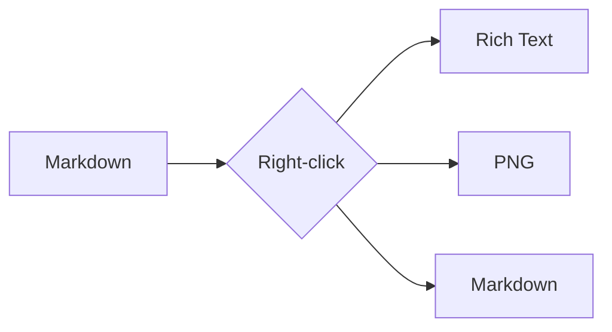

# MarkCopy sample

A quick file to exercise every copy path. Right-click things in the preview.

## Text

This paragraph has **bold**, _italic_, `inline code`, and a [link](https://example.com).

> A blockquote to copy as rich text.

## Table

| Feature        | Built-in | MarkCopy |
| -------------- | :------: | :------: |
| Rich-text copy |    ❌    |    ✅    |
| Table as TSV   |    ❌    |    ✅    |
| Diagram as PNG |    ❌    |    ✅    |

## Code

```ts
export function hello(name: string): string {
  return `Hello, ${name}!`;
}
```

## Diagram



## Math

An inline equation, $E = mc^2$, sits in a sentence. A display one stands alone:

$$
\int_0^\infty e^{-x^2}\,dx = \frac{\sqrt{\pi}}{2}
$$
